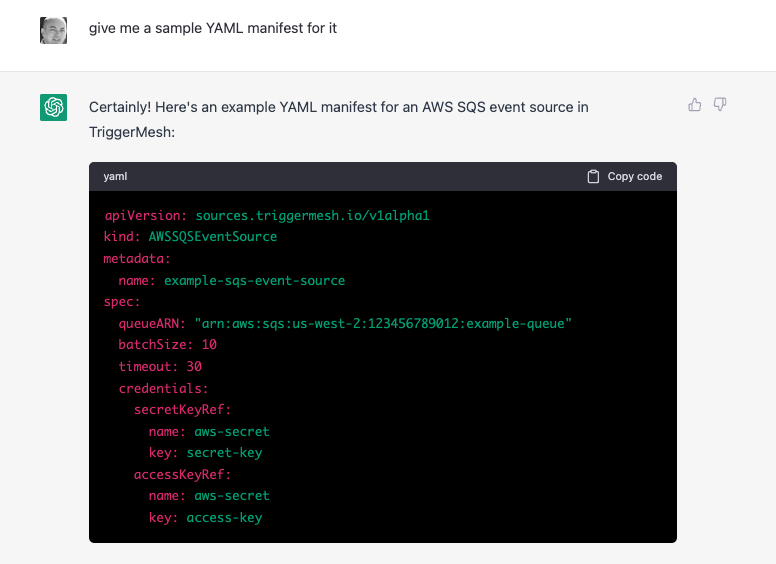
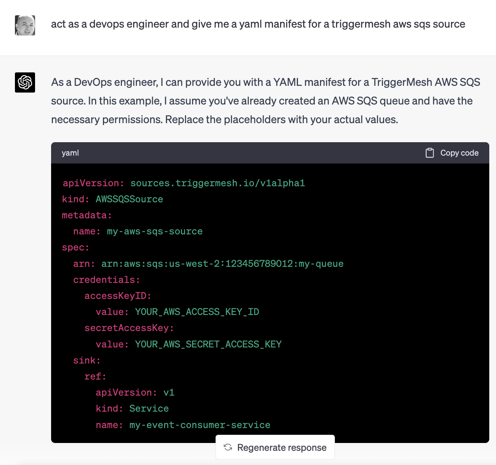

## Experiments with LLMs

This repo presents a few experiments with Large Language Models (LLMs) and AI tools that are being built after the the ChatGPT "moment" :)

### ChatGPT

ChatGPT is based on a LLM and improved with RLHF (Reinforcement Learning with Human Feedback) and a system called InstructGPT. Since LLM are models that provide sentence completion based on context, token by token, it can hallucinate. That means that what ChatGPT answers may not be correct.

However it is improving as OpenAI trains newer models and most likely also trains on conversations we are all having with ChatGPT.

Below is a snapshot where I asked ChatGPT for a manifest of a TriggerMesh AWS SQS source. Over the last 4 months, it has improved a lot and the answer is not "funny" anymore, it is almost correct yet still wrong.

The next snapshot is from April 26th 2023 and it is allready better, a bit of prompting and you can get the correct answer.

We could fine-tune the model but considering the speed at which new models trained on newer data are coming up, the benefit of attempting a fine-tuning is very limited. Might as well wait.

There are ways to create plugins/agents to search outside the LLM model, so we could imagine getting better information by talking to a TriggerMesh API. We could also imagine that if the prompt could handle enough tokens it could take a CRD and generate a corresponding CR sample right away. Until GPT-4-32k the CRDs seem to be too big at least for ChatGPT.

### Code Search with Embeddings

However we can compute embeddings of our own samples and documentation and provide search based on those embeddings. (Is that better than regular search ?)

The [notebook](./embedyaml.ipynb) provides a demonstration of doing such a search.

### Embedding Augmented Prompting

...

